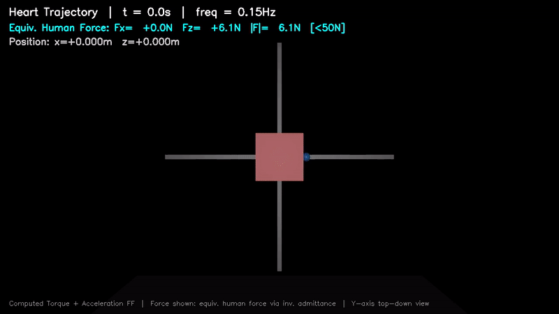

# 机器人控制大作业2：基于导纳控制的直角坐标机器人柔顺操控系统

**学号：2023010916  姓名：张章**



## 文件结构

```
├── report.pdf
├── simulation.py          # 主仿真：三组实验 + 绘图
├── heart_demo.py          # 心形轨迹追踪 + MP4
├── interactive_demo.py    # 交互式 Demo（鼠标拖拽操控）
├── run_demo.sh            # 交互 Demo 启动脚本
├── model.xml              # MuJoCo 模型
├── README.md
└── figures/               # 实验结果（运行脚本后生成）
```

## 依赖

```
Python 3.10+, MuJoCo 3.8+, NumPy, Matplotlib, GLFW, OpenCV, ffmpeg
```

```bash
pip install mujoco numpy matplotlib glfw opencv-python
```

## 运行

### 1. 三组基础实验（水平 / 竖直 / 复合对角）

```bash
python3 simulation.py
```

输出三张实验结果图到 `figures/`，控制台打印性能指标。

### 2. 心形轨迹追踪 + 视频

```bash
# 无显示器环境需设置 EGL 后端
export MUJOCO_GL=egl

python3 heart_demo.py
```

输出 `figures/heart_trajectory.png` 和 `figures/heart_trajectory.mp4`。

### 3. 交互式 Demo

需要图形显示（物理显示器或 VNC 等 X11 环境）。

```bash
bash run_demo.sh
```

| 操作 | 效果 |
|---|---|
| 鼠标左键拖拽红方块 | 施加人力（<50N），导纳控制放大 |
| 鼠标右键拖拽 | 旋转视角 |
| 滚轮 | 缩放 |
| 按 1 / 2 / 3 | 自动演示水平 / 竖直 / 对角 |
| 按 R | 重置 |
| 按 ESC | 退出 |

## 控制方法

**分层导纳控制：**

- **外环（导纳）**：$M_d \dot{v}_d + D_d v_d = F_h$
  - 虚拟质量 $M_d = 3\sim5$ kg，阻尼 $D_d = 35\sim80$ N·s/m
  - 操作者弱力（<50N）转换为期望运动轨迹

- **内环（计算力矩）**：$\tau = M[K_p e + K_v \dot{e}] + G$
  - $K_p = 900$，$K_v = 60$（$\omega_n = 30$ rad/s，临界阻尼）
  - 重力前馈 $G_z = 981$ N（100 kg × 9.81 m/s²）
  - 力放大比约 29 倍

## 实验结果

| 实验 | RMS X (mm) | RMS Z (mm) | 最大人力 (N) | 最大驱动力 (N) |
|---|---|---|---|---|
| 水平运动 | 5.73 | 1.17 | 40.0 | 1102.6 |
| 竖直运动 | 0.00 | 9.59 | 45.0 | 1320.7 |
| 复合对角 | 0.43 | 1.22 | 28.0 | 1232.4 |
| 心形轨迹 | 0.83 | 28.20 | 45.9 (等效) | — |
